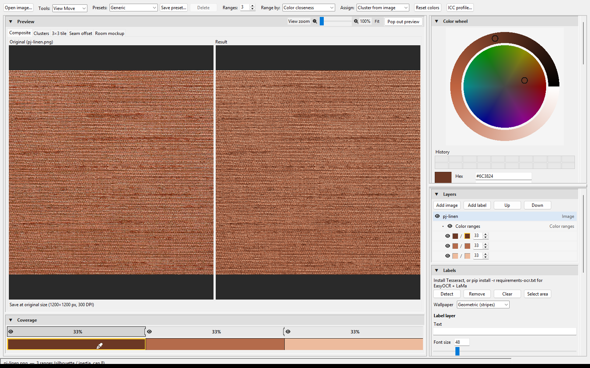
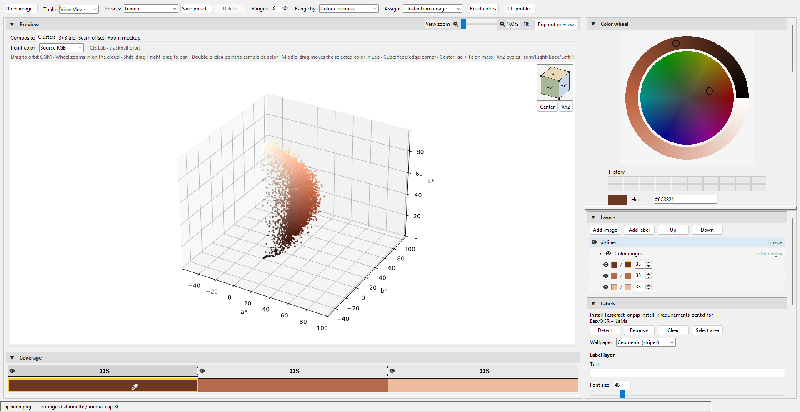
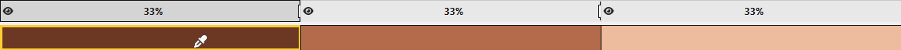
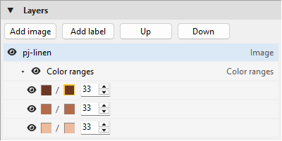
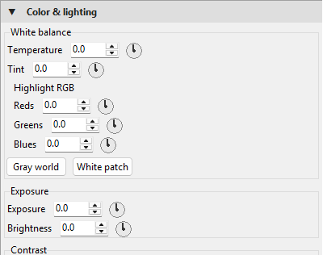
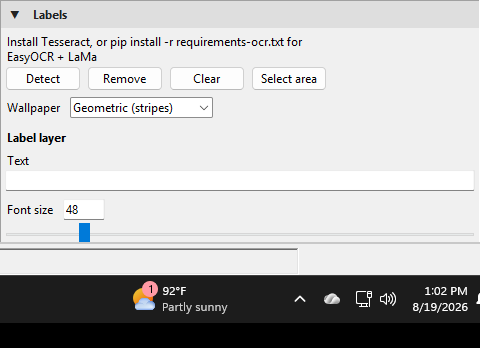
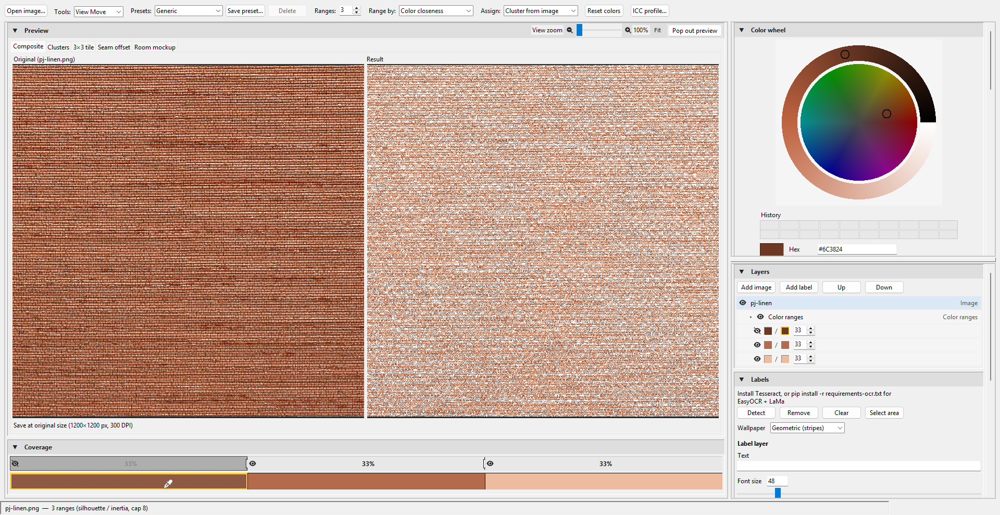
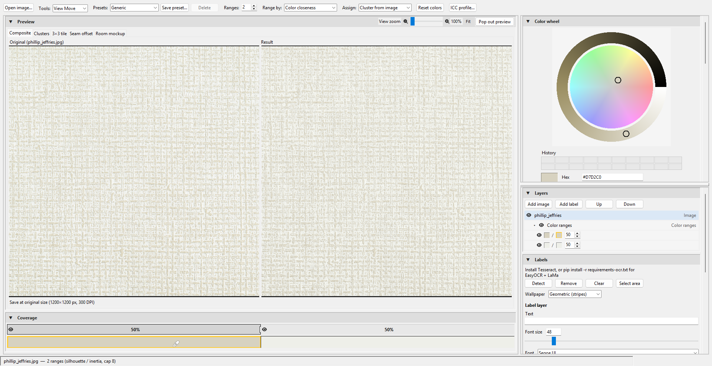

# Wallpaper Recolor

Casamonte desktop remapper for analog-ink wallpaper. Open a TIF, PNG, or JPEG, split it into **color-closeness clusters** (k-means in CIE Lab) or **L\*/a\*/b\* histogram bins**, pick **Pantone change-to** colors on the wheel, keep weave with a **Color/Luminosity grain** mix (Texture slider + eye), and export a **job pack**.

The preview is a live Result composite. Full-resolution remap, optional output scale, and TIFF encode run on a background thread so print-size files stay usable.

Class references (code + name only): CAP3321C Data Wrangling, CAP4631C Machine Learning, CAP4633C Machine Learning 2.

## Where it shines

- **Analogous inks** — close Lab neighbors (linen browns, V6-N greens) stay separable without Rec. 709 luma bands.
- **Print CMY / white balance** — Color & lighting knobs (temperature, tint, highlight RGB, global CMY) grade Result without resetting Texture.
- **Large TIF** — work map is capped for interaction; save still uses the original pixels.
- **Nested color plates** — each Image layer owns a Color ranges sub-tree (match-from / change-to, coverage %, hide-eye knockout).

## Run

```bat
pip install -r requirements.txt
python run_app.py
```

Or double-click `Run-GlobalPython.bat` (uses PATH `python`).

Coworkers without Python: unzip a **Release** setup zip and run **Install.bat** once (needs network; installs CPython into `runtime\`, no admin). After that, **Run-LocalPython.bat**. See `COWORKER.md`.

Optional extras:

| File | What it adds |
|------|----------------|
| `requirements-ocr.txt` | EasyOCR Detect, OpenCV inpaint, LaMa ONNX when `wallpaper_recolor/models/lama.onnx` is present |
| `requirements-plot.txt` | matplotlib 3D Lab scatter on the Clusters tab (otherwise a 2D a\*–b\* canvas) |

The window maximizes on the monitor under the cursor. Closing asks **Yes / No / Cancel** to save a `.wpedit` edit state (Cancel or a failed save leaves the window open).

## Tools and preview

- **View Move** (default) — pan and wheel-zoom the preview camera. Does not change Position & Zoom crop.
- **Grab Move** — drag the selected image inside the output frame (crop X/Y for the base Image, layer x/y for overlays).
- **Fit** — 100% contain-scales the whole wallpaper into both Composite panes (no crop scrollbars). Zoom above 100% multiplies that box. Original and Result share dest size and pan.
- **Hide-range knockout** — eye-off on a color range sets those Result pixels to alpha 0. Preview blits over an 8px checker; save/export keeps real alpha.
- **Clusters** — double-click samples a Lab point onto the active swatch; middle-drag moves the selected color in Lab. Clusters zoom is independent of Composite Fit.

## UI modules (contributors)

`wallpaper_recolor/ui/app.py` is the thin `WallpaperRecolorApp` shell. Feature code lives in mixins:

| Mixin | Responsibility |
|-------|----------------|
| `mixins/chrome.py` | Menubar, View Move / Grab Move, close-save, busy bar |
| `mixins/layout.py` | Paned right column, dock, panel builders, View menu |
| `mixins/preview.py` | Fit/contain, checker blit, eyedrop, Clusters glue |
| `mixins/ranges.py` | Coverage %, presets, hide-eye knockout |
| `mixins/adjust.py` | Color & lighting, texture, Position & Zoom, scale, tessellate |
| `mixins/layers_labels.py` | Layers tree, Labels / OCR |
| `mixins/session.py` | Open, export, job pack, `.wpedit`, undo |

Widgets: `dock.py`, `preview_fit.py`, `widgets.py`, `coverage_bar.py`, `color_wheel.py`, `cluster_view.py`. Launch: `ui/launch.py` via `from wallpaper_recolor.ui import run`.

## Screenshots

Captured from the live Tk window (`ImageGrab`) with `Wallpapers/PJ-Li/pj-linen.png` and `Wallpapers/PJ-W/phillip_jeffries.jpg`. Small copies live in `docs/examples/`. Huge scan TIFs are not in git.

### Composite — linen scan



**How:** File → Open `pj-linen.png`, leave Tools on View Move, Fit 100%. **Why:** this is the working view — Original stays the source crop; Result is the live remap (Texture + range eyes). Three Lab-close brown plates are the analogous-ink case.

### Clusters — Lab scatter



**How:** Preview → Clusters. Drag orbits about the cloud COM; wheel zooms this camera only. **Why:** double-click samples a point onto the selected swatch; middle-drag moves that color in Lab without changing Composite Fit.

### Coverage — plate weights



**How:** Coverage sits under Composite. Click a plate to load match-from / change-to on the wheel; drag weights to steal coverage. **Why:** hide-eye knockout and typed % live here so analog plates can be rebalanced without rebuilding k-means from scratch.

### Layers — ranges under Image



**How:** Bottom-right Layers panel; expand the Image. **Why:** color ranges are a sub-layer set of the Image, not a parallel document. Recolor/tone/tessellate target the selected Image (or its parent when a range row is selected).

### Color & lighting



**How:** Scroll the top-right column to Color & lighting. Knobs are relative drags (near = fine). **Why:** print CMY and white-balance grade Result after remap; Texture slider/eye must not reset these values.

### Labels / OCR



**How:** Bottom-right Labels panel. Detect needs Tesseract or `requirements-ocr.txt`. **Why:** printed logos on a scan can be removed (inpaint) and replaced with an editable label layer without flattening the ink plates.

### Hide-range knockout



**How:** Click the eye on a Coverage plate or Layers range row. **Why:** hidden ranges knock Result alpha to 0; the preview checker shows holes; Original stays full source. Save writes real alpha, not the checker.

### Composite — weave scan



**How:** Open `phillip_jeffries.jpg` (PJ-W). Auto-k chose two plates. **Why:** a second real scan — lighter weave, same Composite / Tools / Fit path as linen.

## Tests

```bat
python -m unittest tests.test_recolor
```

Tk tests `withdraw()` the root so they do not flash a maximized window.

## What is not in this repo

Scan TIFs under `Wallpapers/`, `*_jobpack/` folders, `.wpedit` session files, and `.onnx` weights are gitignored. Keep those local.
